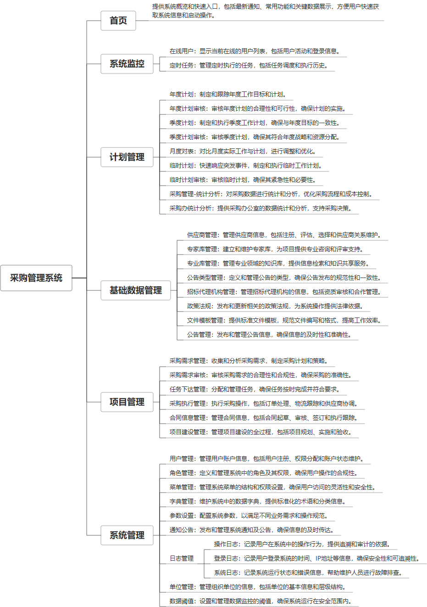

 

    
 

公司拥有上百套具有自主知识产权的软件系统，详情请查看码云首页或公司官网

 
<h1>招标采购系统（供应商管理系统）</h1>

<a href="https://www.haishi.net.cn/">公司官网</a> ｜ <a href="https://www.haishi.net.cn/">在线体验</a>

 

## 系统介绍

包含基础数据管理、供应商和专家库管理，还涉及招标代理机构、政策法规和文件模板的管理。它支持公告和系统日志的管理，以及项目的计划与执行控制，包括采购需求、合同信息和项目建设的管理。此外，系统提供多个定制的首页界面和统计分析功能，以适应不同部门如需求单位、采购管理部门和采购办公室的特定需求，确保企业运作的透明度和效率。
包含基础数据管理、供应商和专家库管理，还涉及招标代理机构、政策法规和文件模板的管理。它支持公告和系统日志的管理，以及项目的计划与执行控制，包括采购需求、合同信息和项目建设的管理。此外，系统提供多个定制的首页界面和统计分析功能，以适应不同部门如需求单位、采购管理部门和采购办公室的特定需求，确保企业运作的透明度和效率。
本项目名称为采购管理系统，是面向企业内部的采购业务管理平台。系统主要功能模块包括：计划管理、采购管理、项目管理、基础数据管理以及系统管理等模块。该系统旨在规范采购流程，提高采购效率，降低采购成本，加强采购风险控制，提升企业采购管理水平。
本项目用户主要为企业内部人员，包含管理员、采购员、项目经理等角色，不同角色拥有不同的系统操作权限。
- 管理员：拥有系统最高权限，可以进行用户管理、角色管理、系统配置等操作。
- 采购员：负责采购需求管理、采购执行管理、合同信息管理等。
- 项目经理：负责项目管理，包括采购需求审核、任务下达管理、项目建设管理等。
                

## 系统功能介绍

### 系统包含终端说明

管理端（WEB）

| 序号 | 模块                  | 模块说明 |
| ---- | --------------------- | -------- |
| 1    | QHY-ZBCG-GYSGL-MANAGE | 管理端   |

### 系统功能结构

### 系统功能说明

{function_description}

## 系统主要界面

## 系统技术说明

### 代码模块说明

| 序号 | 目录 | 目录说明 |
| ---- | ---- | -------- |

### 系统技术选型

#### 开发语言/框架

JAVA（JDK1.8）

#### 服务中间件

Tomcat
Nginx

#### 数据库

MySQL（5.7+）

#### 其他说明

无

## 系统演示/商用

请扫码添加客服微信获取演示地址和系统详细资料。

如果您想基于招标采购系统（供应商管理系统）进行商业化交付或定制开发服务，我们提供有偿的技术服务支持，合作模式不限，欢迎沟通！

公司官网地址： <a href="https://www.haishi.net.cn/">https://www.haishi.net.cn</a>

联系客服获取专业回答。

## 使用须知

1、 本项目商用必须获得版权所有者的授权。

2、 未经允许本项目代码不允许二次出售。

